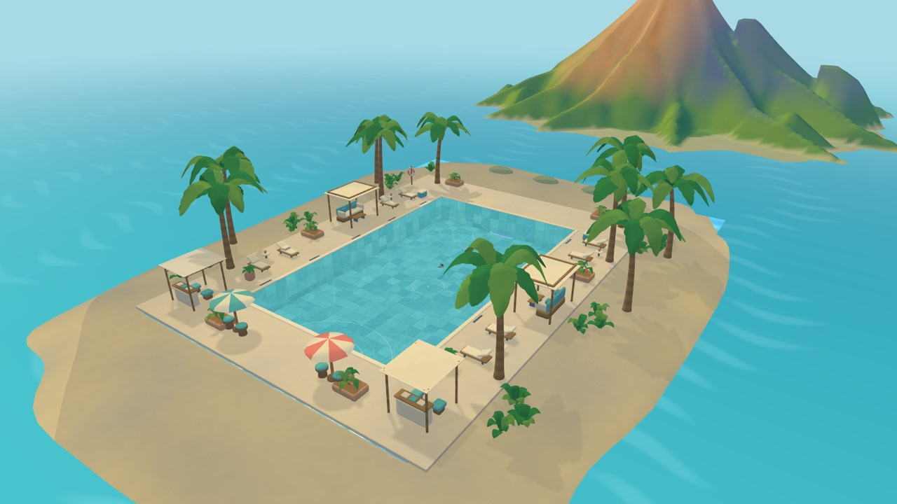
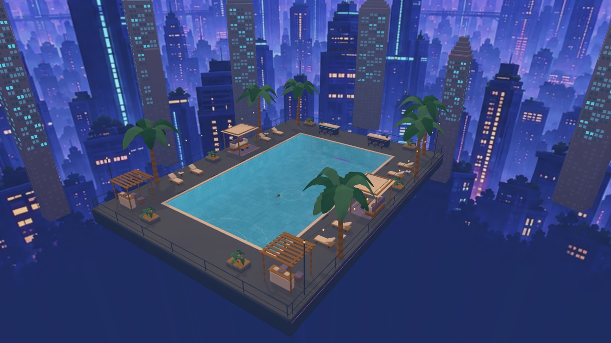

# Otterpuck

A first-person underwater hockey game with eight animal characters and eight stylized arenas. Play against bots, compete with friends, or practice in Free Swim.

[Play in your browser](https://otterpuck.edwinzhang.com)



<p>
  
  
</p>

## Run locally

Install [Bun](https://bun.sh), then:

```sh
bun install --frozen-lockfile
bun run dev
```

Open [localhost:3200](http://127.0.0.1:3200). Blender and a backend are not needed for solo play.

[MIT License](LICENSE) · [Credits](docs/credits.md) · [Contributing](CONTRIBUTING.md)
